# Database Schema & ERD - Hệ thống QR Đặt Món

## 1. Tổng quan

Hệ thống gồm 4 module chính:

- **Customer App**: Khách hàng quét QR, xem menu, đặt món
- **Staff App**: Nhân viên quản lý bàn, xử lý đơn, thanh toán
- **Kitchen Display (KDS)**: Bếp nhận và xử lý đơn
- **Admin Panel**: Quản trị menu, nhân viên, báo cáo

---

## 2. Entity Relationship Diagram (ERD)

```mermaid
erDiagram
    %% ========================================
    %% LAYER 1: USERS & STAFF (Top)
    %% ========================================
    users {
        uuid id PK
        string phone UK
        string email UK
        string password_hash
        string name
        string avatar_url
        enum auth_provider
        boolean is_guest
        boolean is_active
        timestamp created_at
        timestamp updated_at
    }

    staff {
        uuid id PK
        uuid user_id FK
        enum role
        string employee_code UK
        date hire_date
        boolean is_active
        timestamp created_at
    }

    push_tokens {
        uuid id PK
        uuid user_id FK
        string token
        enum device_type
        boolean is_active
        timestamp created_at
    }

    shifts {
        uuid id PK
        uuid staff_id FK
        enum shift_type
        date work_date
        time start_time
        time end_time
        timestamp check_in_at
        timestamp check_out_at
    }

    activity_logs {
        uuid id PK
        uuid staff_id FK
        string action
        string entity_type
        uuid entity_id
        json old_data
        json new_data
        timestamp created_at
    }

    notifications {
        uuid id PK
        uuid user_id FK
        string title
        string body
        enum type
        json data
        boolean is_read
        timestamp created_at
    }

    users ||--o| staff : "is"
    users ||--o{ push_tokens : "has"
    users ||--o{ notifications : "receives"
    staff ||--o{ shifts : "works"
    staff ||--o{ activity_logs : "performs"

    %% ========================================
    %% LAYER 2: AREAS & TABLES
    %% ========================================
    areas {
        uuid id PK
        string name
        string description
        int floor
        int sort_order
        boolean is_active
    }

    tables {
        uuid id PK
        uuid area_id FK
        string table_number UK
        string qr_code_url
        string qr_token UK
        int capacity
        int position_x
        int position_y
        enum status
        boolean is_active
    }

    table_merges {
        uuid id PK
        uuid main_table_id FK
        uuid merged_table_id FK
        uuid merged_by FK
        timestamp merged_at
        timestamp unmerged_at
        boolean is_active
    }

    table_sessions {
        uuid id PK
        uuid user_id FK
        uuid table_id FK
        uuid bill_id FK
        timestamp joined_at
        timestamp left_at
        boolean is_active
    }

    printers {
        uuid id PK
        string name
        string ip_address
        int port
        enum type
        uuid area_id FK
        boolean is_active
    }

    areas ||--o{ tables : "contains"
    areas ||--o{ printers : "has"
    tables ||--o{ table_merges : "merged_as_main"
    tables ||--o{ table_sessions : "has"
    users ||--o{ table_sessions : "joins"

    %% ========================================
    %% LAYER 3: MENU & PRODUCTS
    %% ========================================
    categories {
        uuid id PK
        string name
        string description
        string image_url
        int sort_order
        boolean is_active
    }

    menu_items {
        uuid id PK
        uuid category_id FK
        string name
        string description
        string image_url
        decimal price
        decimal cost_price
        string unit
        enum status
        boolean is_popular
        boolean is_new
        int preparation_time
        int sort_order
    }

    topping_groups {
        uuid id PK
        uuid menu_item_id FK
        string name
        boolean is_required
        int min_select
        int max_select
        int sort_order
    }

    toppings {
        uuid id PK
        uuid group_id FK
        string name
        decimal extra_price
        boolean is_default
        boolean is_available
        int sort_order
    }

    combos {
        uuid id PK
        string name
        string description
        string image_url
        decimal original_price
        decimal combo_price
        int discount_percent
        date start_date
        date end_date
        boolean is_active
    }

    combo_items {
        uuid id PK
        uuid combo_id FK
        uuid menu_item_id FK
        int quantity
        boolean is_required
    }

    categories ||--o{ menu_items : "contains"
    menu_items ||--o{ topping_groups : "has"
    topping_groups ||--o{ toppings : "contains"
    combos ||--o{ combo_items : "includes"
    menu_items ||--o{ combo_items : "part_of"

    %% ========================================
    %% LAYER 4: PROMOTIONS
    %% ========================================
    promotions {
        uuid id PK
        string code UK
        string name
        string description
        enum discount_type
        decimal discount_value
        decimal min_order_amount
        decimal max_discount
        date start_date
        date end_date
        int usage_limit
        int used_count
        boolean is_active
    }

    promotion_usage {
        uuid id PK
        uuid promotion_id FK
        uuid user_id FK
        uuid bill_id FK
        decimal discount_amount
        timestamp used_at
    }

    promotions ||--o{ promotion_usage : "tracked_by"
    users ||--o{ promotion_usage : "uses"

    %% ========================================
    %% LAYER 5: CART (Temporary)
    %% ========================================
    carts {
        uuid id PK
        uuid user_id FK
        uuid table_id FK
        timestamp created_at
        timestamp updated_at
    }

    cart_items {
        uuid id PK
        uuid cart_id FK
        uuid menu_item_id FK
        uuid combo_id FK
        int quantity
        decimal unit_price
        string note
    }

    cart_item_toppings {
        uuid id PK
        uuid cart_item_id FK
        uuid topping_id FK
        int quantity
        decimal price
    }

    users ||--o| carts : "owns"
    tables ||--o{ carts : "has"
    carts ||--o{ cart_items : "contains"
    cart_items ||--o{ cart_item_toppings : "has"
    menu_items ||--o{ cart_items : "added_to"
    toppings ||--o{ cart_item_toppings : "selected_in"

    %% ========================================
    %% LAYER 6: BILLS & ORDERS
    %% ========================================
    bills {
        uuid id PK
        uuid table_id FK
        uuid cashier_id FK
        uuid promotion_id FK
        string bill_number UK
        int guest_count
        decimal subtotal
        decimal discount_amount
        decimal service_charge_amount
        decimal vat_amount
        decimal total_amount
        enum status
        timestamp opened_at
        timestamp closed_at
    }

    orders {
        uuid id PK
        uuid bill_id FK
        uuid user_id FK
        uuid confirmed_by FK
        uuid cancelled_by FK
        string order_number
        enum status
        decimal total_amount
        string note
        string cancel_reason
        timestamp created_at
        timestamp confirmed_at
        timestamp cancelled_at
    }

    order_items {
        uuid id PK
        uuid order_id FK
        uuid menu_item_id FK
        uuid combo_id FK
        uuid prepared_by FK
        uuid served_by FK
        uuid cancelled_by FK
        int quantity
        decimal unit_price
        decimal subtotal
        string note
        enum status
        string cancel_reason
        int priority
        timestamp started_at
        timestamp completed_at
        timestamp served_at
    }

    order_item_toppings {
        uuid id PK
        uuid order_item_id FK
        uuid topping_id FK
        int quantity
        decimal price
    }

    tables ||--o{ bills : "has"
    promotions ||--o{ bills : "applied_to"
    bills ||--o{ orders : "contains"
    users ||--o{ orders : "places"
    orders ||--o{ order_items : "contains"
    menu_items ||--o{ order_items : "ordered_as"
    order_items ||--o{ order_item_toppings : "has"
    toppings ||--o{ order_item_toppings : "used_in"

    %% ========================================
    %% LAYER 7: PAYMENTS
    %% ========================================
    payments {
        uuid id PK
        uuid bill_id FK
        uuid processed_by FK
        decimal amount
        enum method
        enum status
        string transaction_id UK
        string qr_code_url
        string bank_code
        json payment_details
        timestamp paid_at
    }

    bills ||--o{ payments : "paid_via"

    %% ========================================
    %% LAYER 8: REVIEWS & INCIDENTS
    %% ========================================
    reviews {
        uuid id PK
        uuid user_id FK
        uuid order_id FK
        uuid bill_id FK
        int food_rating
        int service_rating
        int ambiance_rating
        decimal average_rating
        string comment
        boolean is_anonymous
        timestamp created_at
    }

    item_reviews {
        uuid id PK
        uuid review_id FK
        uuid menu_item_id FK
        int rating
        string comment
    }

    incidents {
        uuid id PK
        uuid order_item_id FK
        uuid reported_by FK
        uuid resolved_by FK
        enum type
        string description
        enum status
        string resolution
        timestamp reported_at
        timestamp resolved_at
    }

    users ||--o{ reviews : "writes"
    orders ||--o| reviews : "has"
    reviews ||--o{ item_reviews : "contains"
    menu_items ||--o{ item_reviews : "reviewed_in"
    order_items ||--o{ incidents : "has"

    %% ========================================
    %% LAYER 9: SETTINGS
    %% ========================================
    settings {
        uuid id PK
        string key UK
        string value
        string description
        enum type
        timestamp updated_at
    }
```



---

## 3. Chi tiết các bảng

### 3.1. Nhóm User & Authentication

| Bảng | Mô tả |
|------|-------|
| `users` | Thông tin người dùng (khách hàng + nhân viên) |
| `push_tokens` | Token FCM để gửi push notification |
| `staff` | Thông tin nhân viên, phân quyền |
| `shifts` | Ca làm việc của nhân viên |
| `activity_logs` | Log hoạt động (tạo/sửa/xóa order, hủy món...) |

### 3.2. Nhóm Bàn & Khu vực

| Bảng | Mô tả |
|------|-------|
| `areas` | Khu vực (Tầng 1, Tầng 2, VIP...) |
| `tables` | Thông tin bàn + mã QR + vị trí sơ đồ |
| `table_merges` | Gộp/tách bàn |
| `table_sessions` | Phiên khách ngồi bàn (nhiều khách cùng 1 bàn) |

### 3.3. Nhóm Menu

| Bảng | Mô tả |
|------|-------|
| `categories` | Danh mục món (Món chính, Đồ uống...) |
| `menu_items` | Món ăn + thời gian chuẩn bị |
| `topping_groups` | Nhóm tùy chọn (Size, Đá, Đường...) |
| `toppings` | Các tùy chọn cụ thể |
| `combos` | Combo khuyến mãi |
| `combo_items` | Món trong combo |
| `promotions` | Mã giảm giá / voucher |
| `promotion_usage` | Lịch sử sử dụng mã giảm giá |

### 3.4. Nhóm Cart (Giỏ hàng tạm)

| Bảng | Mô tả |
|------|-------|
| `carts` | Giỏ hàng của user tại bàn |
| `cart_items` | Món trong giỏ |
| `cart_item_toppings` | Topping đã chọn trong giỏ |

### 3.5. Nhóm Order & Payment

| Bảng | Mô tả |
|------|-------|
| `bills` | Hóa đơn của bàn (VAT, service charge) |
| `orders` | Đơn hàng (1 bill có nhiều order) |
| `order_items` | Chi tiết món + ai chuẩn bị + ai phục vụ |
| `order_item_toppings` | Topping đã chọn |
| `payments` | Thanh toán (hỗ trợ nhiều phương thức) |

### 3.6. Nhóm Review & Notification

| Bảng | Mô tả |
|------|-------|
| `reviews` | Đánh giá tổng thể của khách |
| `item_reviews` | Đánh giá theo từng món |
| `notifications` | Thông báo |
| `incidents` | Sự cố (món trả lại, sai order...) |

### 3.7. Nhóm Cấu hình

| Bảng | Mô tả |
|------|-------|
| `printers` | Cấu hình máy in (bill, bếp) |
| `settings` | Cài đặt hệ thống |

---

## 4. Enum Values

```sql
-- User auth provider
CREATE TYPE auth_provider AS ENUM ('local', 'google');

-- Staff roles
CREATE TYPE staff_role AS ENUM ('waiter', 'cashier', 'kitchen', 'manager', 'admin');

-- Shift types
CREATE TYPE shift_type AS ENUM ('morning', 'afternoon', 'evening');

-- Table status
CREATE TYPE table_status AS ENUM ('available', 'occupied', 'reserved', 'cleaning');

-- Menu item status
CREATE TYPE menu_status AS ENUM ('available', 'out_of_stock', 'suspended');

-- Order status
CREATE TYPE order_status AS ENUM ('pending', 'confirmed', 'preparing', 'ready', 'served', 'cancelled');

-- Order item status
CREATE TYPE order_item_status AS ENUM ('pending', 'preparing', 'ready', 'served', 'cancelled');

-- Bill status
CREATE TYPE bill_status AS ENUM ('open', 'requesting_payment', 'paid', 'cancelled');

-- Payment method
CREATE TYPE payment_method AS ENUM ('cash', 'qr_banking', 'card', 'momo', 'zalopay');

-- Payment status
CREATE TYPE payment_status AS ENUM ('pending', 'completed', 'failed', 'refunded');

-- Discount type
CREATE TYPE discount_type AS ENUM ('percent', 'fixed');

-- Notification type
CREATE TYPE notification_type AS ENUM ('order_confirmed', 'order_ready', 'order_served', 'payment_success', 'promotion', 'system');

-- Device type
CREATE TYPE device_type AS ENUM ('android', 'ios');

-- Incident type
CREATE TYPE incident_type AS ENUM ('returned', 'wrong_order', 'quality_issue', 'delay', 'other');

-- Incident status
CREATE TYPE incident_status AS ENUM ('open', 'in_progress', 'resolved');

-- Printer type
CREATE TYPE printer_type AS ENUM ('receipt', 'kitchen', 'label');

-- Setting type
CREATE TYPE setting_type AS ENUM ('string', 'number', 'boolean', 'json');

-- Activity action
CREATE TYPE activity_action AS ENUM ('create', 'update', 'delete', 'cancel', 'confirm');
```

---

## 5. Indexes quan trọng

```sql
-- Users
CREATE INDEX idx_users_phone ON users(phone) WHERE phone IS NOT NULL;
CREATE INDEX idx_users_email ON users(email) WHERE email IS NOT NULL;
CREATE INDEX idx_users_is_guest ON users(is_guest);

-- Staff
CREATE INDEX idx_staff_user_id ON staff(user_id);
CREATE INDEX idx_staff_role ON staff(role);

-- Tables
CREATE INDEX idx_tables_qr_token ON tables(qr_token);
CREATE INDEX idx_tables_status ON tables(status);
CREATE INDEX idx_tables_area_id ON tables(area_id);

-- Table Sessions
CREATE INDEX idx_table_sessions_user ON table_sessions(user_id);
CREATE INDEX idx_table_sessions_table ON table_sessions(table_id);
CREATE INDEX idx_table_sessions_active ON table_sessions(is_active) WHERE is_active = true;

-- Carts
CREATE INDEX idx_carts_user ON carts(user_id);
CREATE INDEX idx_carts_table ON carts(table_id);

-- Bills
CREATE INDEX idx_bills_table_id ON bills(table_id);
CREATE INDEX idx_bills_status ON bills(status);
CREATE INDEX idx_bills_opened_at ON bills(opened_at);
CREATE INDEX idx_bills_cashier ON bills(cashier_id);

-- Orders
CREATE INDEX idx_orders_bill_id ON orders(bill_id);
CREATE INDEX idx_orders_user_id ON orders(user_id);
CREATE INDEX idx_orders_status ON orders(status);
CREATE INDEX idx_orders_created_at ON orders(created_at);

-- Order Items
CREATE INDEX idx_order_items_order_id ON order_items(order_id);
CREATE INDEX idx_order_items_status ON order_items(status);
CREATE INDEX idx_order_items_menu_item ON order_items(menu_item_id);
CREATE INDEX idx_order_items_prepared_by ON order_items(prepared_by);

-- Menu Items
CREATE INDEX idx_menu_items_category ON menu_items(category_id);
CREATE INDEX idx_menu_items_status ON menu_items(status);
CREATE INDEX idx_menu_items_is_popular ON menu_items(is_popular) WHERE is_popular = true;

-- Payments
CREATE INDEX idx_payments_bill_id ON payments(bill_id);
CREATE INDEX idx_payments_status ON payments(status);
CREATE INDEX idx_payments_transaction ON payments(transaction_id);

-- Reviews
CREATE INDEX idx_reviews_user ON reviews(user_id);
CREATE INDEX idx_reviews_order ON reviews(order_id);
CREATE INDEX idx_reviews_created ON reviews(created_at);

-- Item Reviews
CREATE INDEX idx_item_reviews_menu_item ON item_reviews(menu_item_id);
CREATE INDEX idx_item_reviews_rating ON item_reviews(rating);

-- Activity Logs
CREATE INDEX idx_activity_logs_staff ON activity_logs(staff_id);
CREATE INDEX idx_activity_logs_entity ON activity_logs(entity_type, entity_id);
CREATE INDEX idx_activity_logs_created ON activity_logs(created_at);

-- Notifications
CREATE INDEX idx_notifications_user ON notifications(user_id);
CREATE INDEX idx_notifications_unread ON notifications(user_id, is_read) WHERE is_read = false;

-- Shifts
CREATE INDEX idx_shifts_staff ON shifts(staff_id);
CREATE INDEX idx_shifts_date ON shifts(work_date);

-- Incidents
CREATE INDEX idx_incidents_order_item ON incidents(order_item_id);
CREATE INDEX idx_incidents_status ON incidents(status);
```

---

## 6. Flow chính

### 6.1. Flow đặt món

```text
1. Khách quét QR → lấy table_id từ qr_token
2. Tạo table_session (gán user vào bàn)
3. Kiểm tra bill đang mở của bàn, nếu chưa có → tạo bill mới
4. Khách chọn món → thêm vào cart + cart_items
5. Khách bấm "Gửi order" → chuyển cart thành order + order_items, xóa cart
6. Nhân viên xác nhận → order.status = 'confirmed', ghi confirmed_by
7. Bếp nhận → order_items.status = 'preparing', ghi prepared_by, started_at
8. Bếp xong → order_items.status = 'ready', ghi completed_at
9. Phục vụ mang ra → order_items.status = 'served', ghi served_by, served_at
```

### 6.2. Flow thanh toán

```text
1. Khách yêu cầu thanh toán → bill.status = 'requesting_payment'
2. Thu ngân xem bill, áp dụng promotion nếu có
3. Tính tổng: subtotal + service_charge + VAT - discount
4. Tạo payment record
5. Nếu QR banking → tạo QR code VietQR, chờ webhook xác nhận
6. Xác nhận thanh toán → payment.status = 'completed', bill.status = 'paid'
7. Cập nhật table.status = 'cleaning'
8. Gửi notification cho khách
```

### 6.3. Flow KDS (Kitchen Display)

```text
1. Order mới vào → hiển thị trên màn hình bếp
2. Sắp xếp theo: thời gian đặt, priority, loại món
3. Đầu bếp bấm "Bắt đầu" → order_items.status = 'preparing'
4. Hiển thị timer (thời gian từ khi order)
5. Cảnh báo nếu > preparation_time của món
6. Đầu bếp bấm "Xong" → order_items.status = 'ready'
7. Thông báo cho phục vụ mang ra
```

### 6.4. Flow xử lý sự cố

```text
1. Khách phản hồi món có vấn đề
2. Nhân viên tạo incident record
3. Xử lý: đổi món / hủy món / giảm giá
4. Ghi nhận resolution
5. Dữ liệu dùng cho báo cáo và AI phân tích sau này
```

---

## 7. Báo cáo có thể truy vấn

### 7.1. Báo cáo doanh thu

- Doanh thu theo ngày/tuần/tháng: `bills.total_amount` GROUP BY date
- Doanh thu theo ca: JOIN `shifts` với `bills`
- Doanh thu theo khu vực: JOIN `areas` → `tables` → `bills`
- Doanh thu theo nhân viên: `bills.cashier_id`

### 7.2. Báo cáo món

- Món bán chạy: COUNT `order_items` GROUP BY `menu_item_id`
- Món ít bán: tương tự, ORDER ASC
- Tỷ lệ hủy: COUNT `order_items` WHERE status = 'cancelled'

### 7.3. Báo cáo vận hành

- Số đơn/ca: COUNT `orders` JOIN `shifts`
- Giá trị trung bình: AVG `bills.total_amount`
- Thời gian phục vụ: `order_items.served_at` - `orders.created_at`
- Thời gian thanh toán: `bills.closed_at` - `bills.payment_requested_at`

### 7.4. Báo cáo review

- Thống kê sao: COUNT `reviews` GROUP BY rating
- Review theo món: `item_reviews` GROUP BY `menu_item_id`
- Sự cố: COUNT `incidents` GROUP BY type
